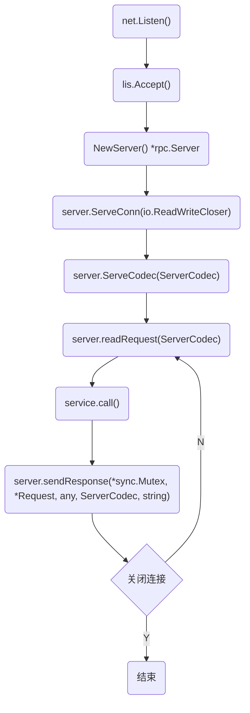
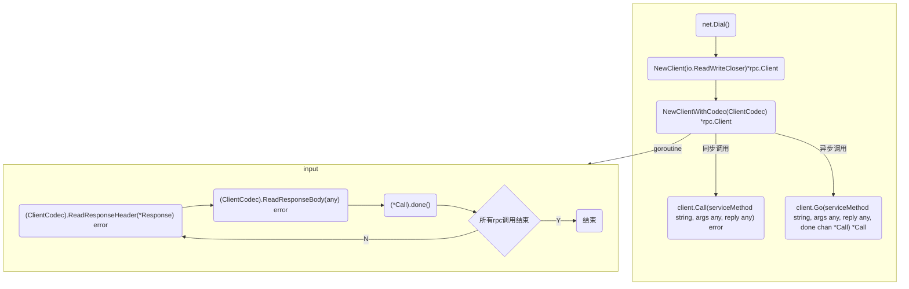

# 1 生成自定义服务文件
`protoc-gen-tinyrpc` 为自定义插件，可帮助开发者将 proto 文件生成 tinyrpc 对应的服务文件（.srv.go）和 proto 序列化与反序列化文件（.pb.go）。

> 自定义插件编写推荐阅读：https://mdnice.com/writing/ab4aec3d6936437f904cd18c1996ce4e

> 源码：https://github.com/yusank/protoc-gen-go-http


# 2 TinyRPC 
&emsp;&emsp;TinyRpc 是基于 Go 语言标准库 net/rpc 扩展的远程过程调用框架，它具有以下特性：
- 基于 TCP 传输层协议支持多种压缩格式：gzip、snappy、zlib；
- 基于二进制的 Protocol Buffer 序列化协议：具有协议编码小及高扩展性和跨平台性；
- 支持自定义序列化器。
- 支持生成工具：TinyRPC提供的 protoc-gen-tinyrpc 插件可以帮助开发者快速定义自己的服务；

> tinyprc源码：https://github.com/zehuamama/tinyrpc

# 3 标准库 net/rpc 网络框架

## 3.1 Server
### 3.1.1 rpc.Server 
```go
// Server represents an RPC Server.
type Server struct {
	serviceMap sync.Map   // map[string]*service
	reqLock    sync.Mutex // protects freeReq
	freeReq    *Request   // 相当于 Request 对象池
	respLock   sync.Mutex // protects freeResp
	freeResp   *Response  // 相当于 Response 对象池
}

type Request struct {
	ServiceMethod string   // format: "Service.Method"
	Seq           uint64   // sequence number chosen by client
	next          *Request // for free list in Server
}

type Response struct {
	ServiceMethod string    // echoes that of the Request
	Seq           uint64    // echoes that of the request
	Error         string    // error, if any.
	next          *Response // for free list in Server
}
```

### 3.1.2 服务注册
```go
type methodType struct {
	sync.Mutex // protects counters
	method     reflect.Method
	ArgType    reflect.Type
	ReplyType  reflect.Type
	numCalls   uint
}

type service struct {
	name   string                 // name of service
	rcvr   reflect.Value          // receiver of methods for the service
	typ    reflect.Type           // type of the receiver
	method map[string]*methodType // registered methods
}
```

**服务注册流程：**
1. 通过调用 rpc.NewServer() 创建 Server 实例。
1. Server.Register() 或 Server.RegisterName() 将服务注册入 Server.serviceMap 中。


### 3.1.3 通信流程

#### 3.1.3.1 服务端流程

<center>



</center>

1. 绑定 ip 建立监听，并创建 rpc Server；
1. 接收连接请求，开启协程（serveConn()）进行连接处理；
1. 选择会话处理对象（serveCodec），对 rpc 请求与响应进行编解码处理；
1. 根据 rpc 请求进行 rpc 调用并返回响应结果。

#### 3.1.3.2 serveCodec

```go
// ServerCodec为RPC会话的服务器端实现了RPC请求的读取和RPC响应的写入。 
// 服务器成对调用ReadRequestHeader和ReadRequestBody来读取来自连接的请求，并调用writerresponse来写回响应。 
// 服务器在完成连接后调用Close。 
// 可以使用nil参数调用ReadRequestBody，以强制读取并丢弃请求体。 有关并发访问的信息，请参阅NewClient的注释。 
type ServerCodec interface {
	ReadRequestHeader(*Request) error
	ReadRequestBody(any) error
	WriteResponse(*Response, any) error

	// Close can be called multiple times and must be idempotent.
	Close() error
}
```
TinyRPC 主要实现的这里，增加了对 RPC 请求与响应进行序列化与反序列化（proto/json），并压缩与解压缩（raw/gizp/snappy/zlib）流程。具体实现见代码。

## 3.2 Client

### 3.2.1 rpc.Clinet 
```go
// Client represents an RPC Client.
// There may be multiple outstanding Calls associated
// with a single Client, and a Client may be used by
// multiple goroutines simultaneously.
type Client struct {
	codec ClientCodec

	reqMutex sync.Mutex         // protects following
	request  Request            // Request pool

	mutex    sync.Mutex         // protects following
	seq      uint64
	pending  map[uint64]*Call   // 存储多个调用
	closing  bool               // user has called Close
	shutdown bool               // server has told us to stop
}

type Request struct {
	ServiceMethod string   // format: "Service.Method"
	Seq           uint64   // sequence number chosen by client
	next          *Request // for free list in Server
}
```

### 3.2.2 通信流程

#### 3.2.2.1 调用流程



1. 与 rpc Server 建立连接（net.Dial()），并创建 rpc Client；
1. 选择会话处理对象（ClientCodec），对 rpc 请求与响应进行编解码处理，并且开启协程（input()）用于接收 rpc 服务端响应；
1. 通过 Go() 和 Call() 方法实现 rpc 的异步和同步调用。

#### 3.2.2.2 ClientCodec

```go
//一个ClientCodec实现RPC请求的写入和为RPC会话的客户端读取RPC响应。  
//客户端调用WriteRequest向连接写入请求  
//并成对调用ReadResponseHeader和ReadResponseBody  
//读取响应。方法完成时，客户机调用Close连接。
//ReadResponseBody可以用nil来调用参数强制读取响应体，然后丢弃。  
type ClientCodec interface {
	WriteRequest(*Request, any) error
	ReadResponseHeader(*Response) error
	ReadResponseBody(any) error

	Close() error
}
```
TinyRPC 主要实现的这里，增加了对 RPC 请求与响应进行序列化与反序列化（proto/json），并压缩与解压缩（raw/gizp/snappy/zlib）流程。具体实现见代码。
